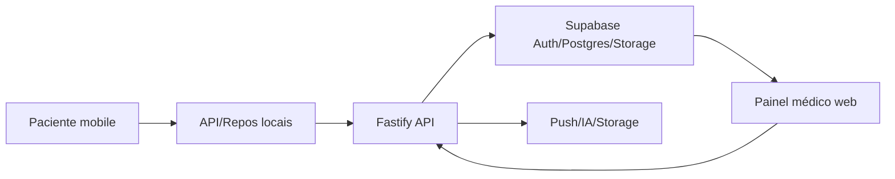

# Arquitetura

O paciente usa mobile/Expo e persiste dados locais críticos via WatermelonDB; APIs mobile ficam em `apps/mobile/src/lib/api.ts` e nos repositórios `apps/mobile/src/watermelon/*`. O painel médico usa `apps/web/src/lib/api.ts` e consulta a API. A API Fastify valida autenticação, regras de negócio, auditoria, arquivos, chat, notificações e integrações de IA. Supabase fornece identidade, Postgres, Storage e RLS; Prisma é usado pelo pacote DB.

Pontos de atenção: autenticação e resolução de paciente/médico em `services/api/src/middleware/auth.ts`; auditoria em `lib/audit.ts`; chamadas mobile/web em `lib/api.ts`; sincronização WatermelonDB em `apps/mobile/src/watermelon/sync.ts`; rotas e contratos em `services/api/src/routes` e `packages/shared/src/schemas`.
