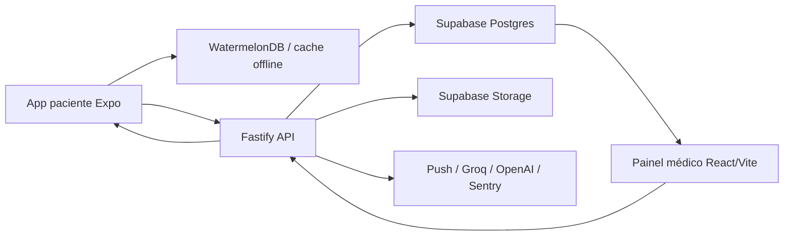

# Arquitetura e estrutura

## Visão geral

Monorepo TypeScript com npm workspaces e Turborepo. A indexação de código observada em 17/07/2026 contém 2.157 nós, 4.172 relações, 449 funções, 211 arquivos de código e 91 rotas.

## Módulos

- `apps/mobile`: Expo 52, React Native 0.76, React Navigation, TanStack Query, Supabase JS, WatermelonDB e APIs Expo. Entrada em `index.ts` e `src/App.tsx`.
- `apps/web`: React 18 + Vite 5. Painel médico em `src/pages`, sessão em `src/hooks/useSession.ts`, API em `src/lib/api.ts`.
- `services/api`: Fastify 5. Entrada em `src/server.ts`; rotas em `src/routes`; autenticação/autorização em `src/middleware`; storage, auditoria e notificações em `src/lib`.
- `packages/shared`: schemas Zod, tipos e constantes compartilhados.
- `packages/db`: Prisma e scripts de banco.
- `supabase`: migrations SQL, RLS e documentação do modelo de identidade/storage.
- `e2e`: Playwright; fluxo conhecido em `auth-and-demands.spec.ts`.

## Pontos de maior impacto

- `apps/mobile/src/lib/api.ts`: cliente central mobile, usado por muitos fluxos.
- `apps/web/src/lib/api.ts`: cliente central do painel.
- `services/api/src/middleware/auth.ts`: resolução de acesso e vínculo clínico.
- `services/api/src/lib/audit.ts`: auditoria transversal.
- `apps/mobile/src/watermelon/sync.ts`: sincronização offline.
- `packages/shared/src/schemas`: contratos entre clientes e API.
- `supabase/migrations`: fonte de verdade do banco e RLS.

## Rotas/domínios existentes

Auth, health, me, patients, demands, chat, audio, transcription, AI, assistants, headache diary, seizure diary, health events, documents, exams, recipes, notifications e push tokens. Confirmar payloads nos handlers e schemas; não deduzir contratos apenas pelos nomes.
