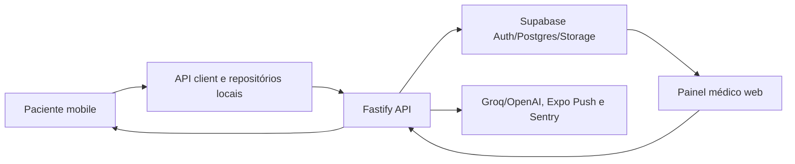

# Contexto mestre do MEDconecta

## Produto

MEDconecta conecta pacientes e equipe médica. O paciente usa um app Expo/React Native; o médico usa um painel React/Vite. O sistema cobre autenticação, onboarding/PIN, chat texto/áudio, demandas, diários de cefaleia e convulsão, eventos de saúde, receitas, documentos, exames, notificações, push, biometria e assistentes.

## Arquitetura confirmada

- Monorepo TypeScript com npm workspaces e Turborepo.
- `apps/mobile`: Expo 52, React Native 0.76, React Navigation, TanStack Query, Supabase e WatermelonDB; lado do paciente e exportação web.
- `apps/web`: React 18 + Vite; painel médico.
- `services/api`: Fastify 5; autenticação, regras de negócio, auditoria, chat, demandas, arquivos, notificações e IA.
- `packages/shared`: contratos, tipos e schemas Zod compartilhados.
- `packages/db`: Prisma e acesso tipado ao Postgres.
- `supabase/migrations`: schema SQL, RLS, onboarding e push tokens.
- Supabase: Auth, Postgres, Storage privado, Realtime e políticas RLS.
- WatermelonDB: armazenamento e sincronização offline do mobile.

## Entradas e áreas críticas

- Mobile: `apps/mobile/src/App.tsx`, `navigation/`, `screens/`, `features/headache/`, `features/seizure/`, `watermelon/`, `lib/api.ts`.
- Web: `apps/web/src/App.tsx`, `pages/`, `lib/api.ts`, `lib/supabase.ts`, `index.css`.
- API: `services/api/src/server.ts`, `routes/`, `middleware/auth.ts`, `middleware/assistantAccess.ts`, `lib/`.
- Contratos: `packages/shared/src/schemas/`.
- Dados: `packages/db/prisma/schema.prisma`, `supabase/migrations/`.
- Testes: `e2e/auth-and-demands.spec.ts`, `playwright.config.ts`.
- Deploy: `.github/workflows/`, `docker-compose.yml`, `railway.json`, `vercel.json`, `apps/*/netlify.toml`, nginx/entrypoints.

## Fluxo arquitetural

## Direção visual

O paciente segue o sistema Fluent Accent: superfícies claras, azul-petróleo, cabeçalho com gradiente, cartões arredondados, tipografia limpa, hierarquia forte, navegação inferior e detalhes laranja/lilás. Referências: `app-mockup.canvas.tsx`, `MANUAL DA MARCA PARA ENVIO (1).pdf`, `diario de cefaleia/` e documentação raiz. O painel médico deve pertencer ao mesmo sistema visual sem copiar literalmente o layout mobile. Preserve toda lógica durante mudanças visuais.

## Segurança

Dados são sensíveis. Preserve RLS, autorização, signed URLs, auditoria e logs sem PHI. Nunca exponha `.env`. A documentação registra credencial previamente embutida no remote Git e senha de VPS compartilhada; devem ser rotacionadas e nunca reproduzidas. Qualquer migration ou deploy exige confirmação explícita.

## Ambiente e comandos

Node >=20; npm 10.8.2. Comandos raiz: `npm install`, `npm run dev:api`, `npm run dev:web`, `npm run dev -w @medconecta/mobile`, `npm run typecheck`, `npm run lint`, `npm run build`, `npm run test:e2e`, `npm run db:generate`, `npm run db:apply`.

Variáveis devem ser obtidas apenas pelos nomes em `.env.example`, `services/api/.env.example` e `apps/web/.env.example`. Não leia ou mostre valores do `.env` real no chat.
